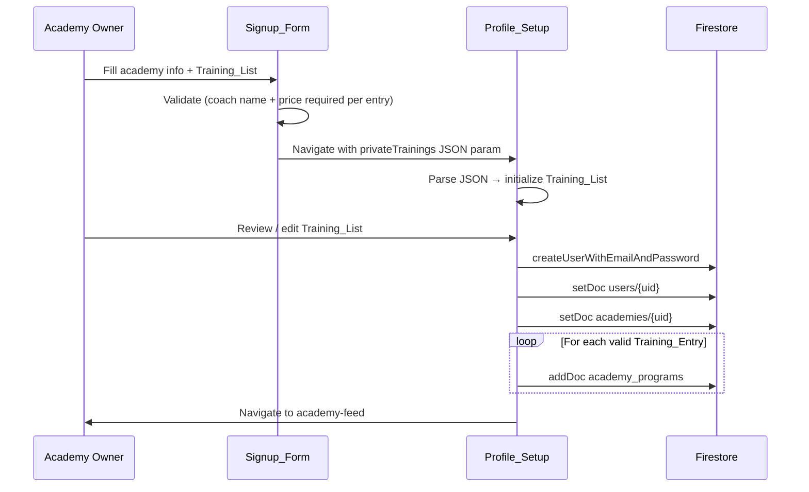

# Design Document: Academy Multiple Private Trainings

## Overview

This feature fully specifies and validates the multiple private training entries flow across the two-step academy signup. The infrastructure already exists in the codebase — `privateTrainings` array state, `addTraining`/`removeTraining`/`updateTraining` handlers, and downstream Firestore writes in `signup-academy-profile.tsx` — but the behavior needs to be hardened with correct validation, UI rules, and data propagation guarantees.

The change is entirely contained within two screens:
- `app/signup-academy.tsx` — the first signup step (Signup_Form)
- `app/signup-academy-profile.tsx` — the second signup step (Profile_Setup)

No new routes, services, or backend endpoints are required.

## Architecture

The feature follows the existing two-screen signup pattern:

```
Signup_Form (signup-academy.tsx)
  │  collects: academy info + Training_List
  │  validates: required fields + at least one fee
  │  serializes: privateTrainings → JSON string in route params
  ▼
Profile_Setup (signup-academy-profile.tsx)
  │  deserializes: JSON string → Training_List
  │  allows: add/remove/edit Training_Entry items
  │  on submit: creates Firestore docs for valid entries
  ▼
Firebase Auth + Firestore
  users/{uid}, academies/{uid}, academy_programs (one doc per valid entry)
```

The Training_List is local React state on each screen. It is passed between screens as a JSON-serialized route param (`privateTrainings`). No shared store or context is needed.



## Components and Interfaces

### Training_Entry shape

Both screens share the same in-memory shape for a single training entry:

```typescript
interface TrainingEntry {
  coachName: string;
  privateTrainingPrice: string;
  coachBio: string;
  specializations: string;
  sessionDuration: string; // numeric string, default "60"
  availability: string;
}
```

### Signup_Form (`signup-academy.tsx`)

State:
- `privateTrainings: TrainingEntry[]` — initialized with one empty entry

Handlers:
- `addTraining()` — appends a new empty entry (sessionDuration defaults to "60")
- `removeTraining(index)` — removes entry at index; no-op if list has only one entry
- `updateTraining(index, field, value)` — updates a single field of a single entry

UI rules:
- Always show the Add_Button below all training blocks
- Show numbered header ("Training #N") only when list length > 1
- Show Remove_Button in header only when list length > 1
- `sessionDuration` input: numeric only, maxLength 3
- `privateTrainingPrice` input: numeric only, maxLength 6

Validation on submit:
- Every entry must have a non-empty `coachName`
- Every entry must have a non-empty `privateTrainingPrice`
- On failure: show inline error, do not navigate
- On success: serialize `privateTrainings` to JSON and pass as route param

### Profile_Setup (`signup-academy-profile.tsx`)

Initialization:
- Parse `params.privateTrainings` JSON string into `TrainingEntry[]`
- Fall back to a single empty entry if parsing fails

Same add/remove/edit handlers as Signup_Form.

On submit:
- For each entry where `coachName` and `privateTrainingPrice` are both non-empty, create an `academy_programs` Firestore document
- Skip entries missing either field silently (no error shown)

### Firestore document shape (`academy_programs`)

```typescript
interface AcademyProgramDoc {
  academyId: string;
  name: 'Private Training';
  type: 'private_training';
  fee: number;                        // parseFloat(privateTrainingPrice)
  description: string;                // "Private training sessions with {coachName}"
  coachName: string;
  coachBio: string | null;
  specializations: string[];          // split on comma, trimmed
  maxParticipants: 1;
  duration: number;                   // parseInt(sessionDuration) || 60
  availability: { general: string } | null;
  isActive: true;
  createdAt: Timestamp;
  updatedAt: Timestamp;
}
```

## Data Models

### Training_List state

```
Training_List = TrainingEntry[]   (length >= 1)
```

Invariants:
- Length is always ≥ 1
- Indices are contiguous (0-based array, no gaps)
- Numbered UI headers display as 1-based ("Training #1", "Training #2", …)

### Route param serialization

The Training_List is serialized as a JSON string when navigating from Signup_Form to Profile_Setup:

```
params.privateTrainings = JSON.stringify(TrainingEntry[])
```

Profile_Setup deserializes with `JSON.parse`. If parsing throws, the screen falls back to a single empty entry.

### Validation rules

| Field | Required in Signup_Form | Required for Firestore write |
|---|---|---|
| coachName | yes (blocks navigation) | yes (skips entry if empty) |
| privateTrainingPrice | yes (blocks navigation) | yes (skips entry if empty) |
| coachBio | no | no |
| specializations | no | no |
| sessionDuration | no (defaults to "60") | no (defaults to 60) |
| availability | no | no |
